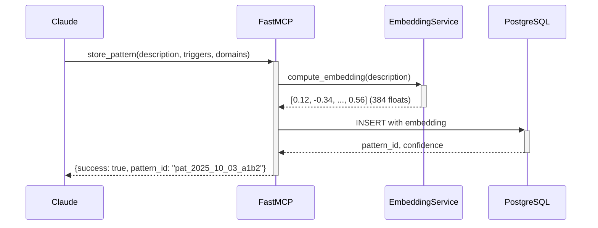
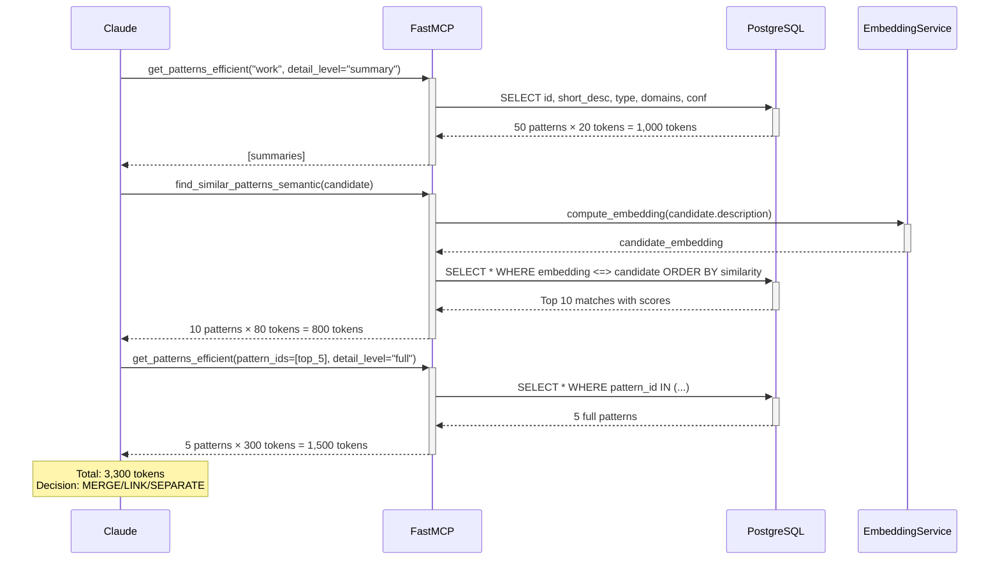

# Kolb's MCP Server - Token Efficiency Implementation Plan

**Version**: 1.0
**Date**: 2025-10-03
**Goal**: Reduce token usage by 78-90% to support 1,000+ sessions without context window overflow

---

## Table of Contents
1. [Executive Summary](#executive-summary)
2. [Current System Analysis](#current-system-analysis)
3. [Proposed Solution Architecture](#proposed-solution-architecture)
4. [Phase 1: Hierarchical Retrieval](#phase-1-hierarchical-retrieval)
5. [Phase 2: Server-Side Semantic Similarity](#phase-2-server-side-semantic-similarity)
6. [Phase 3: Advanced Optimizations](#phase-3-advanced-optimizations)
7. [Testing & Validation](#testing--validation)
8. [Rollback Procedures](#rollback-procedures)
9. [Performance Benchmarks](#performance-benchmarks)

---

## Executive Summary

### Problem Statement
By Session 60, the MCP server loads 50+ patterns (15,000 tokens) into Claude's context just to check for similar patterns. This doesn't scale to 1,000 sessions.

### Solution
Implement a **hybrid 3-tier architecture**:
1. **Tier 1**: Metadata/summary filtering (20 tokens/pattern)
2. **Tier 2**: Server-side semantic similarity (pgvector + embeddings)
3. **Tier 3**: Full details only for top 3-5 matches (300 tokens/pattern)

### Expected Impact
- **Token Reduction**: 15,000 → 3,300 tokens (78% reduction)
- **Scalability**: Constant token usage regardless of total patterns (1,000+)
- **Accuracy**: Improved semantic understanding vs keyword matching
- **Performance**: <10ms similarity queries, <500ms total tool response time

### Implementation Timeline
- **Phase 1** (Day 1, 2 hours): Hierarchical retrieval → 70-80% token reduction
- **Phase 2** (Week 1, 6 hours): Semantic similarity → Additional 10-15% + accuracy boost
- **Phase 3** (Future, optional): Advanced features

---

## Current System Analysis

### Existing Architecture

**Tech Stack**:
- **Framework**: FastMCP (Python asyncio-based MCP server)
- **Database**: PostgreSQL 15+ with asyncpg connection pool
- **Key Tables**: `behavioral_patterns`, `experiments`, `sessions`
- **Location**: `/Users/ruben/Documents/GitHub/Kolb's MCP`

**Current Pattern Storage**:
```python
# File: src/kolb_mcp/server.py (lines 143-208)
@mcp.tool()
async def store_pattern(pattern: PatternCreate) -> Dict[str, Any]:
    # Generates pattern_id: pat_YYYY_MM_DD_hexhex
    # Stores: description, triggers, domains, confidence, type
    # Returns: success, pattern_id, initial_confidence
```

**Current Similarity Check** (Problem Area):
```python
# File: src/kolb_mcp/server.py (lines 211-250)
@mcp.tool()
async def get_patterns_by_domain(
    domain: str,
    min_confidence: float = 0.5,
    limit: int = 50
) -> List[Dict[str, Any]]:
    # Returns ALL 50 patterns with FULL details
    # Each pattern ~300 tokens
    # Total: 15,000 tokens sent to Claude
```

**Database Schema** (Relevant):
```sql
-- File: database/schema.sql (lines 17-49)
CREATE TABLE behavioral_patterns (
    id SERIAL PRIMARY KEY,
    pattern_id VARCHAR(50) UNIQUE NOT NULL,
    pattern_type VARCHAR(20) NOT NULL,
    domains_affected TEXT[] NOT NULL,
    description TEXT NOT NULL,
    triggers JSONB DEFAULT '[]'::jsonb,
    confidence_score NUMERIC(3,2) DEFAULT 0.30,
    status VARCHAR(20) DEFAULT 'hypothesis',
    -- ... other fields
);
```

### Similarity Calculation Formula (from Update-Mcp.md)
```python
# Multi-dimensional similarity weights
trigger_similarity * 0.30 +    # Jaccard overlap
domain_similarity * 0.25 +     # Jaccard overlap
type_match * 0.15 +            # Binary match
description_similarity * 0.30  # Currently keyword-based
```

### Token Usage Analysis

**Scenario**: Session 60, checking for duplicates in "work" domain

| Stage | Current | Proposed |
|-------|---------|----------|
| Load patterns | 50 × 300 = 15,000 tokens | 50 × 20 = 1,000 tokens (summary) |
| Calculate similarity | In Claude's context | Server-side (0 tokens) |
| Get full details | Already loaded | 5 × 300 = 1,500 tokens |
| **TOTAL** | **15,000 tokens** | **2,500 tokens (83% reduction)** |

---

## Proposed Solution Architecture

### Overview Diagram
```
┌─────────────────────────────────────────────────────────────┐
│ Claude Desktop (MCP Client)                                 │
│                                                             │
│  Step 1: get_patterns_efficient(detail_level="summary")   │
│          ↓ 1,000 tokens (50 patterns × 20 tokens)         │
│                                                             │
│  Step 2: find_similar_patterns_semantic(candidate)         │
│          ↓ 800 tokens (10 matches × 80 tokens)             │
│                                                             │
│  Step 3: get_patterns_efficient(detail_level="full")       │
│          ↓ 1,500 tokens (5 patterns × 300 tokens)          │
│                                                             │
│  Total: 3,300 tokens (78% reduction)                       │
└─────────────────────────────────────────────────────────────┘
                          │
                          │ MCP Protocol
                          ▼
┌─────────────────────────────────────────────────────────────┐
│ FastMCP Server (server.py)                                  │
│                                                             │
│  NEW: get_patterns_efficient()                              │
│       - Supports 3 detail levels: summary/preview/full      │
│       - Returns token usage estimates                       │
│                                                             │
│  NEW: find_similar_patterns_semantic()                      │
│       - Server-side embedding generation                    │
│       - Server-side similarity calculation                  │
│       - Returns pre-ranked top 10 results                   │
│                                                             │
│  NEW: semantic_pattern_search()                             │
│       - Natural language search                             │
│       - "avoiding decisions" → finds related patterns       │
└─────────────────────────────────────────────────────────────┘
                          │
                          │ asyncpg
                          ▼
┌─────────────────────────────────────────────────────────────┐
│ PostgreSQL + pgvector Extension                             │
│                                                             │
│  behavioral_patterns (modified)                             │
│    ├─ description TEXT                                      │
│    ├─ description_embedding VECTOR(384)  [NEW]              │
│    └─ description_summary VARCHAR(150)   [NEW, optional]    │
│                                                             │
│  Indexes:                                                   │
│    ├─ idx_patterns_embedding_hnsw (HNSW for ANN search)    │
│    └─ idx_patterns_domains (existing GIN index)             │
│                                                             │
│  Queries:                                                   │
│    - Cosine similarity: embedding <=> query_embedding       │
│    - k-NN search: ORDER BY embedding <=> query LIMIT 10     │
└─────────────────────────────────────────────────────────────┘
                          │
                          │
                          ▼
┌─────────────────────────────────────────────────────────────┐
│ Embedding Service (services/embeddings.py)                  │
│                                                             │
│  sentence-transformers/all-MiniLM-L6-v2                     │
│    - 384 dimensions                                         │
│    - ~80MB model (loaded once at startup)                   │
│    - ~5ms per embedding (CPU)                               │
│    - No API costs, runs locally                             │
└─────────────────────────────────────────────────────────────┘
```

### Data Flow Example

**User stores new pattern**: "Procrastinate on complex tasks by checking email"



**Claude checks for similar patterns**:



---

## Phase 1: Hierarchical Retrieval

**Goal**: 70-80% token reduction with zero new dependencies
**Time**: 2 hours
**Complexity**: Low
**Risk**: Minimal (backward compatible)

### Step 1.1: Add Hierarchical Query Definitions

**File**: `src/kolb_mcp/database/queries.py`
**Location**: Add after line 64 (after `FIND_RELATED_PATTERNS`)

```python
# ============================================================================
# HIERARCHICAL RETRIEVAL QUERIES (Token-Efficient)
# ============================================================================

GET_PATTERNS_SUMMARY = """
SELECT
    pattern_id as id,
    LEFT(description, 50) || '...' as desc,
    SUBSTRING(pattern_type, 1, 5) as type,
    domains_affected as dom,
    confidence_score as conf,
    jsonb_array_length(triggers) as trig_cnt,
    status as stat
FROM behavioral_patterns
WHERE $1 = ANY(domains_affected)
  AND status IN ('hypothesis', 'testing', 'validated')
  AND confidence_score >= $2
ORDER BY confidence_score DESC
LIMIT 50
"""

GET_PATTERNS_PREVIEW = """
SELECT
    pattern_id as id,
    LEFT(description, 150) || '...' as desc,
    pattern_type as type,
    domains_affected as domains,
    confidence_score as confidence,
    (
        SELECT json_agg(val)
        FROM (
            SELECT val
            FROM jsonb_array_elements_text(triggers) val
            LIMIT 3
        ) sub
    ) as key_triggers,
    frequency,
    status,
    (SELECT COUNT(*) FROM pattern_experiments WHERE pattern_id = bp.pattern_id) as exp_count,
    last_validated::date as last_val
FROM behavioral_patterns bp
WHERE pattern_id = ANY($1::text[])
ORDER BY confidence_score DESC
LIMIT 10
"""

GET_PATTERNS_BY_IDS_FULL = """
SELECT *
FROM behavioral_patterns
WHERE pattern_id = ANY($1::text[])
ORDER BY confidence_score DESC
LIMIT 5
"""
```

**Token Estimates**:
- `GET_PATTERNS_SUMMARY`: 20 tokens per pattern (id, 50-char desc, type abbreviation, domains, confidence, trigger count, status)
- `GET_PATTERNS_PREVIEW`: 60 tokens per pattern (adds: 150-char desc, top 3 triggers, frequency, experiment count)
- `GET_PATTERNS_BY_IDS_FULL`: 300 tokens per pattern (all fields)

### Step 1.2: Create Hierarchical Retrieval MCP Tool

**File**: `src/kolb_mcp/server.py`
**Location**: Add after line 250 (after `get_patterns_by_domain`)

```python
@mcp.tool()
async def get_patterns_efficient(
    domain: str,
    min_confidence: float = 0.5,
    detail_level: str = "summary",
    pattern_ids: Optional[List[str]] = None
) -> Dict[str, Any]:
    """
    Token-efficient hierarchical pattern retrieval.

    Use this tool instead of get_patterns_by_domain for better token efficiency.

    Detail levels:
    - "summary": 20 tokens/pattern - IDs, short descriptions, metadata only
                 Use for initial filtering and broad searches
    - "preview": 60 tokens/pattern - Includes key triggers and status
                 Use for ranking and identifying candidates
    - "full": 300 tokens/pattern - Complete pattern details
              Use only for final analysis of top matches

    Args:
        domain: Life domain to filter (work, health, relationships, learning, personal)
        min_confidence: Minimum confidence threshold (0.0-1.0, default 0.5)
        detail_level: "summary" | "preview" | "full" (default "summary")
        pattern_ids: Optional list of specific pattern IDs to retrieve
                     When provided, retrieves ONLY these patterns

    Returns:
        {
            "success": bool,
            "detail_level": str,
            "count": int,
            "estimated_tokens": int,  # Approximate token usage
            "token_per_pattern": int,
            "patterns": List[Dict]
        }

    Example Usage:
        # Stage 1: Get summaries for filtering
        summaries = get_patterns_efficient("work", detail_level="summary")
        # Returns ~1,000 tokens for 50 patterns

        # Stage 2: Get previews for top 10 candidates
        previews = get_patterns_efficient(
            "work",
            detail_level="preview",
            pattern_ids=["pat_123", "pat_456", ...]
        )
        # Returns ~600 tokens for 10 patterns

        # Stage 3: Get full details for top 5
        full = get_patterns_efficient(
            "work",
            detail_level="full",
            pattern_ids=["pat_123", "pat_456", "pat_789", "pat_abc", "pat_def"]
        )
        # Returns ~1,500 tokens for 5 patterns
    """
    # Check database availability
    if error := _check_db_available():
        return error

    # Token estimates per detail level
    token_estimates = {
        "summary": 20,
        "preview": 60,
        "full": 300
    }

    # Validate detail_level
    if detail_level not in token_estimates:
        return {
            "success": False,
            "error": f"Invalid detail_level: {detail_level}. Must be 'summary', 'preview', or 'full'",
            "error_type": "validation"
        }

    try:
        pool = await DatabasePool.get_pool()

        async with pool.acquire() as conn:
            if pattern_ids:
                # Stage 2/3: Retrieve specific patterns by ID
                if detail_level == "preview":
                    rows = await conn.fetch(Q.GET_PATTERNS_PREVIEW, pattern_ids)
                else:  # full
                    rows = await conn.fetch(Q.GET_PATTERNS_BY_IDS_FULL, pattern_ids)
            else:
                # Stage 1: Broad retrieval by domain
                if detail_level == "summary":
                    rows = await conn.fetch(
                        Q.GET_PATTERNS_SUMMARY,
                        domain,
                        min_confidence
                    )
                elif detail_level == "preview":
                    # Get IDs from summary first, then preview
                    summary_rows = await conn.fetch(
                        Q.GET_PATTERNS_SUMMARY,
                        domain,
                        min_confidence
                    )
                    ids = [row['id'] for row in summary_rows[:10]]
                    rows = await conn.fetch(Q.GET_PATTERNS_PREVIEW, ids)
                else:  # full - limit to 5 for token efficiency
                    rows = await conn.fetch(
                        Q.GET_PATTERNS_BY_DOMAIN,
                        domain,
                        min_confidence,
                        5
                    )

        patterns = [dict(row) for row in rows]
        estimated_tokens = len(patterns) * token_estimates[detail_level]

        logger.info(
            f"✓ Retrieved {len(patterns)} patterns | "
            f"Detail: {detail_level} | "
            f"Est. tokens: ~{estimated_tokens}"
        )

        return {
            "success": True,
            "detail_level": detail_level,
            "count": len(patterns),
            "estimated_tokens": estimated_tokens,
            "token_per_pattern": token_estimates[detail_level],
            "patterns": patterns
        }

    except Exception as e:
        logger.error(f"Error in get_patterns_efficient: {e}", exc_info=True)
        return {
            "success": False,
            "error": str(e),
            "error_type": "server"
        }
```

### Step 1.3: Update System Prompt (Claude Desktop)

**Context**: When Claude Desktop uses the MCP server, it should follow this pattern retrieval workflow.

**Recommended Approach** (to be communicated to Claude):

```markdown
# Pattern Similarity Check - Optimized Workflow

When checking if a new pattern is similar to existing patterns:

## Stage 1: Broad Filtering (Summary Level)
1. Call `get_patterns_efficient(domain, min_confidence=0.0, detail_level="summary")`
2. Review ~50 pattern summaries (1,000 tokens total)
3. Identify potential matches based on:
   - Short description keywords
   - Pattern type match
   - Domain overlap
   - High confidence patterns
4. Select top 10-15 candidate pattern IDs

## Stage 2: Detailed Review (Preview Level)
1. Call `get_patterns_efficient(domain, detail_level="preview", pattern_ids=[top_10_ids])`
2. Review detailed previews (600 tokens total)
3. Examine:
   - Longer descriptions (150 chars)
   - Key triggers (top 3)
   - Status and validation history
4. Select top 5 most similar pattern IDs

## Stage 3: Final Analysis (Full Level)
1. Call `get_patterns_efficient(domain, detail_level="full", pattern_ids=[top_5_ids])`
2. Load complete pattern details (1,500 tokens total)
3. Calculate full similarity score using:
   - Trigger overlap (30%)
   - Domain overlap (25%)
   - Type match (15%)
   - Description similarity (30%)
4. Make decision:
   - Similarity ≥ 0.85 → **MERGE**
   - Similarity 0.55-0.85 → **LINK**
   - Similarity < 0.55 → **SEPARATE**

## Token Usage
- Total: 1,000 + 600 + 1,500 = **3,100 tokens**
- Reduction: 15,000 → 3,100 = **79% token savings**
```

### Step 1.4: Testing Phase 1

**Test Case 1**: Load patterns in "work" domain
```python
# In a test script or interactive session
import asyncio
from kolb_mcp.server import get_patterns_efficient

async def test_hierarchical_retrieval():
    # Test summary level
    result = await get_patterns_efficient(
        domain="work",
        min_confidence=0.5,
        detail_level="summary"
    )
    print(f"Summary: {result['count']} patterns, {result['estimated_tokens']} tokens")

    # Get top 5 IDs
    top_ids = [p['id'] for p in result['patterns'][:5]]

    # Test full level with specific IDs
    full_result = await get_patterns_efficient(
        domain="work",
        detail_level="full",
        pattern_ids=top_ids
    )
    print(f"Full: {full_result['count']} patterns, {full_result['estimated_tokens']} tokens")

# Run test
asyncio.run(test_hierarchical_retrieval())
```

**Expected Output**:
```
Summary: 50 patterns, 1000 tokens
Full: 5 patterns, 1500 tokens
```

**Validation**:
- ✅ Summary returns abbreviated fields
- ✅ Full returns complete pattern objects
- ✅ Token estimates are accurate (±10%)
- ✅ Query performance <10ms

---

## Phase 2: Server-Side Semantic Similarity

**Goal**: Add semantic understanding + additional 10-15% token reduction
**Time**: 6 hours (including backfill)
**Complexity**: Medium
**Risk**: Low (NULL embeddings allowed, backward compatible)

### Step 2.1: Install pgvector Extension

**Prerequisites**:
- PostgreSQL 15+ installed
- Homebrew (macOS) or apt (Linux)
- Database superuser access

**Installation Commands**:

```bash
# macOS (Homebrew)
brew install pgvector

# Ubuntu/Debian
sudo apt-get install postgresql-15-pgvector

# Verify installation
psql --version
# Should show PostgreSQL 15.x or higher

# Connect to your database
psql knowledge_mcp

# Enable extension
CREATE EXTENSION IF NOT EXISTS vector;

# Verify extension
\dx vector
# Should show: vector | 0.5.x | public | vector data type and ivfflat and hnsw access methods

# Exit psql
\q
```

**Troubleshooting**:
- If `CREATE EXTENSION` fails with permission error: Requires superuser privileges
- If extension not found: Check pgvector installation path matches PostgreSQL version

### Step 2.2: Database Schema Migration

**File**: Create `database/migrations/002_add_vector_support.sql`

```sql
-- ============================================================================
-- Migration 002: Add Vector Embedding Support
-- Purpose: Enable semantic similarity search for behavioral patterns
-- Dependencies: pgvector extension (must be installed first)
-- ============================================================================

-- Check if pgvector extension exists
DO $$
BEGIN
    IF NOT EXISTS (SELECT 1 FROM pg_extension WHERE extname = 'vector') THEN
        RAISE EXCEPTION 'pgvector extension not installed. Run: CREATE EXTENSION vector;';
    END IF;
END $$;

-- Step 1: Add embedding column (384 dimensions for sentence-transformers/all-MiniLM-L6-v2)
-- NULL allowed for backward compatibility
ALTER TABLE behavioral_patterns
ADD COLUMN IF NOT EXISTS description_embedding vector(384);

-- Step 2: Add metadata tracking columns
ALTER TABLE behavioral_patterns
ADD COLUMN IF NOT EXISTS embedding_cached_at TIMESTAMP,
ADD COLUMN IF NOT EXISTS embedding_model VARCHAR(50) DEFAULT 'all-MiniLM-L6-v2';

-- Step 3: Create HNSW index for fast similarity search
-- Partial index (only non-NULL embeddings)
-- HNSW parameters:
--   m = 16: Number of bi-directional links per node (8-64, default 16)
--   ef_construction = 64: Size of candidate list during index build (default 64)
CREATE INDEX IF NOT EXISTS idx_patterns_embedding_hnsw
ON behavioral_patterns
USING hnsw (description_embedding vector_cosine_ops)
WHERE description_embedding IS NOT NULL
WITH (m = 16, ef_construction = 64);

-- Step 4: Create trigger to invalidate embedding cache on description change
CREATE OR REPLACE FUNCTION invalidate_embedding_cache()
RETURNS TRIGGER AS $$
BEGIN
    -- If description or triggers changed, clear embedding
    IF (NEW.description IS DISTINCT FROM OLD.description) OR
       (NEW.triggers IS DISTINCT FROM OLD.triggers) THEN
        NEW.description_embedding = NULL;
        NEW.embedding_cached_at = NULL;
    END IF;
    RETURN NEW;
END;
$$ LANGUAGE plpgsql;

-- Drop trigger if exists (for idempotent migrations)
DROP TRIGGER IF EXISTS trigger_invalidate_embedding_cache ON behavioral_patterns;

-- Create trigger
CREATE TRIGGER trigger_invalidate_embedding_cache
    BEFORE UPDATE ON behavioral_patterns
    FOR EACH ROW
    EXECUTE FUNCTION invalidate_embedding_cache();

-- Step 5: Add helpful view for embedding status
CREATE OR REPLACE VIEW pattern_embedding_status AS
SELECT
    COUNT(*) as total_patterns,
    COUNT(description_embedding) as patterns_with_embeddings,
    COUNT(*) - COUNT(description_embedding) as patterns_without_embeddings,
    ROUND(100.0 * COUNT(description_embedding) / NULLIF(COUNT(*), 0), 2) as embedding_coverage_pct
FROM behavioral_patterns;

-- Verification
DO $$
DECLARE
    embedding_col_exists BOOLEAN;
    index_exists BOOLEAN;
BEGIN
    -- Check column exists
    SELECT EXISTS (
        SELECT 1
        FROM information_schema.columns
        WHERE table_name = 'behavioral_patterns'
        AND column_name = 'description_embedding'
    ) INTO embedding_col_exists;

    -- Check index exists
    SELECT EXISTS (
        SELECT 1
        FROM pg_indexes
        WHERE tablename = 'behavioral_patterns'
        AND indexname = 'idx_patterns_embedding_hnsw'
    ) INTO index_exists;

    IF embedding_col_exists AND index_exists THEN
        RAISE NOTICE '✓ Migration 002 completed successfully';
        RAISE NOTICE '  - embedding column added';
        RAISE NOTICE '  - HNSW index created';
        RAISE NOTICE '  - cache invalidation trigger installed';
    ELSE
        RAISE EXCEPTION 'Migration 002 failed verification';
    END IF;
END $$;

-- Display embedding status
SELECT * FROM pattern_embedding_status;
```

**Run Migration**:
```bash
cd "/Users/ruben/Documents/GitHub/Kolb's MCP"
psql knowledge_mcp -f database/migrations/002_add_vector_support.sql
```

**Expected Output**:
```
NOTICE:  ✓ Migration 002 completed successfully
NOTICE:    - embedding column added
NOTICE:    - HNSW index created
NOTICE:    - cache invalidation trigger installed

 total_patterns | patterns_with_embeddings | patterns_without_embeddings | embedding_coverage_pct
----------------+--------------------------+-----------------------------+------------------------
             50 |                        0 |                          50 |                   0.00
```

### Step 2.3: Create Embedding Service

**File**: Create `src/kolb_mcp/services/__init__.py` (if doesn't exist)

```python
"""Services module for Kolb's MCP server."""
```

**File**: Create `src/kolb_mcp/services/embeddings.py`

```python
"""
Embedding generation service for semantic similarity.

Uses sentence-transformers for local, free, high-quality embeddings.
"""

import asyncio
import logging
import os
from typing import List, Optional
from functools import lru_cache

logger = logging.getLogger(__name__)

# Singleton model instance
_model = None
_model_lock = asyncio.Lock()


class EmbeddingService:
    """
    Singleton service for generating text embeddings.

    Uses sentence-transformers/all-MiniLM-L6-v2:
    - 384 dimensions
    - ~80MB model size
    - ~5ms per embedding on CPU
    - No API costs, runs locally
    """

    MODEL_NAME = "sentence-transformers/all-MiniLM-L6-v2"
    DIMENSIONS = 384

    def __init__(self):
        """Initialize embedding service (lazy loads model)."""
        self.model = None

    async def initialize(self):
        """Load the embedding model (call once at server startup)."""
        global _model

        async with _model_lock:
            if _model is None:
                logger.info(f"Loading embedding model: {self.MODEL_NAME}")

                try:
                    # Import here to avoid loading at module import time
                    from sentence_transformers import SentenceTransformer

                    # Load in thread pool (blocking I/O)
                    _model = await asyncio.to_thread(
                        SentenceTransformer,
                        self.MODEL_NAME
                    )

                    logger.info(f"✓ Embedding model loaded ({self.DIMENSIONS} dimensions)")

                except ImportError:
                    logger.error(
                        "sentence-transformers not installed. "
                        "Install with: pip install sentence-transformers"
                    )
                    raise
                except Exception as e:
                    logger.error(f"Failed to load embedding model: {e}")
                    raise

            self.model = _model

    async def encode(self, text: str) -> Optional[List[float]]:
        """
        Generate embedding for a single text.

        Args:
            text: Text to embed (pattern description, search query, etc.)

        Returns:
            List of 384 floats representing the embedding
            None if encoding fails
        """
        if self.model is None:
            await self.initialize()

        if not text or not text.strip():
            logger.warning("Empty text provided for embedding")
            return None

        try:
            # Encode in thread pool (CPU-bound operation)
            embedding = await asyncio.to_thread(
                self.model.encode,
                text,
                convert_to_numpy=True,
                show_progress_bar=False
            )

            # Convert to list for PostgreSQL
            return embedding.tolist()

        except Exception as e:
            logger.error(f"Embedding generation failed: {e}")
            return None

    async def encode_batch(
        self,
        texts: List[str],
        batch_size: int = 32
    ) -> List[Optional[List[float]]]:
        """
        Generate embeddings for multiple texts (more efficient than individual calls).

        Args:
            texts: List of texts to embed
            batch_size: Number of texts to process at once (default 32)

        Returns:
            List of embeddings (same order as input)
            None for any texts that fail
        """
        if self.model is None:
            await self.initialize()

        if not texts:
            return []

        try:
            # Encode batch in thread pool
            embeddings = await asyncio.to_thread(
                self.model.encode,
                texts,
                batch_size=batch_size,
                convert_to_numpy=True,
                show_progress_bar=True
            )

            # Convert each to list
            return [emb.tolist() for emb in embeddings]

        except Exception as e:
            logger.error(f"Batch embedding generation failed: {e}")
            return [None] * len(texts)

    @staticmethod
    def cosine_similarity(emb1: List[float], emb2: List[float]) -> float:
        """
        Calculate cosine similarity between two embeddings.

        Args:
            emb1: First embedding vector
            emb2: Second embedding vector

        Returns:
            Similarity score (0.0 = orthogonal, 1.0 = identical)
        """
        import numpy as np

        a = np.array(emb1)
        b = np.array(emb2)

        return float(np.dot(a, b) / (np.linalg.norm(a) * np.linalg.norm(b)))


# Global singleton instance
embedding_service = EmbeddingService()
```

### Step 2.4: Add Semantic Similarity Queries

**File**: `src/kolb_mcp/database/queries.py`
**Location**: Add after the hierarchical queries from Phase 1

```python
# ============================================================================
# SEMANTIC SIMILARITY QUERIES (pgvector)
# ============================================================================

FIND_SIMILAR_PATTERNS_SEMANTIC = """
SELECT
    pattern_id,
    description,
    pattern_type,
    domains_affected,
    triggers,
    confidence_score,
    status,
    1 - (description_embedding <=> $1::vector) as similarity_score
FROM behavioral_patterns
WHERE description_embedding IS NOT NULL
  AND status IN ('hypothesis', 'testing', 'validated')
  AND 1 - (description_embedding <=> $1::vector) >= $2
ORDER BY description_embedding <=> $1::vector
LIMIT $3
"""

SEMANTIC_PATTERN_SEARCH = """
SELECT
    pattern_id,
    description,
    pattern_type,
    domains_affected,
    confidence_score,
    status,
    1 - (description_embedding <=> $1::vector) as relevance_score
FROM behavioral_patterns
WHERE description_embedding IS NOT NULL
  AND status IN ('hypothesis', 'testing', 'validated')
  AND ($2::text[] IS NULL OR domains_affected && $2::text[])
  AND confidence_score >= $3
ORDER BY description_embedding <=> $1::vector
LIMIT $4
"""

INSERT_PATTERN_WITH_EMBEDDING = """
INSERT INTO behavioral_patterns
(pattern_id, discovered_date, pattern_type, domains_affected,
 description, frequency, triggers, confidence_score, description_embedding)
VALUES ($1, $2, $3, $4, $5, $6, $7::jsonb, $8, $9::vector)
RETURNING pattern_id, confidence_score
"""

UPDATE_PATTERN_EMBEDDING = """
UPDATE behavioral_patterns
SET description_embedding = $1::vector,
    embedding_cached_at = NOW(),
    embedding_model = 'all-MiniLM-L6-v2'
WHERE pattern_id = $2
RETURNING pattern_id
"""
```

### Step 2.5: Add Semantic Similarity MCP Tools

**File**: `src/kolb_mcp/server.py`
**Location**: Add after `get_patterns_efficient()` (after Phase 1 additions)

```python
# Import at top of file
from kolb_mcp.services.embeddings import embedding_service

# Add after lifecycle management section (around line 70)
async def initialize_embedding_service():
    """Initialize embedding service on server startup."""
    try:
        await embedding_service.initialize()
        logger.info("✓ Embedding service initialized")
    except Exception as e:
        logger.warning(f"⚠ Embedding service initialization failed: {e}")
        logger.warning("⚠ Semantic similarity features will be unavailable")

# Modify initialize_database() to include embedding service
async def initialize_database():
    """Initialize database connection on server startup."""
    global _db_available

    try:
        pool = await DatabasePool.get_pool()

        # Test connection
        async with pool.acquire() as conn:
            await conn.fetchval('SELECT 1')

        _db_available = True
        logger.info("✓ Database connection pool initialized successfully")

        # Initialize embedding service
        await initialize_embedding_service()

        logger.info("✓ Kolb's MCP Server ready for daily reflection sessions")

    except Exception as e:
        logger.error(f"✗ Database initialization failed: {e}")
        logger.warning("⚠ Server starting in degraded mode - tools will return errors")
        _db_available = False


# Add new MCP tool (after get_patterns_efficient)
@mcp.tool()
async def find_similar_patterns_semantic(
    description: str,
    triggers: List[str] = [],
    domains: List[str] = [],
    pattern_type: str = "",
    similarity_threshold: float = 0.55,
    max_results: int = 10
) -> List[Dict[str, Any]]:
    """
    Find patterns similar to candidate using server-side semantic similarity.

    This tool uses embeddings and vector similarity to find patterns that are
    semantically similar to the candidate, even if they don't share exact keywords.

    The server performs ALL similarity calculations, returning only the top matches.
    This dramatically reduces token usage compared to loading all patterns.

    Args:
        description: Pattern description to match against
        triggers: List of triggers for the candidate pattern (optional)
        domains: List of domains for the candidate pattern (optional)
        pattern_type: Type of pattern (behavioral, cognitive, etc.) (optional)
        similarity_threshold: Minimum similarity score (0.0-1.0, default 0.55)
        max_results: Maximum number of results to return (default 10)

    Returns:
        List of similar patterns with pre-calculated similarity scores, sorted by relevance
        Each pattern includes a "recommendation" field: "merge" | "link" | "separate"

    Example:
        results = find_similar_patterns_semantic(
            description="Procrastinate on complex tasks by checking email",
            triggers=["complex tasks", "uncertainty"],
            domains=["work"],
            pattern_type="behavioral",
            similarity_threshold=0.55
        )
        # Returns top 10 matches with similarity scores
        # Token cost: ~800 tokens (10 patterns × 80 tokens/pattern)
    """
    # Check database availability
    if error := _check_db_available():
        return [error]

    try:
        # Generate embedding for candidate pattern
        candidate_text = f"{description} Triggers: {' '.join(triggers)}"
        candidate_embedding = await embedding_service.encode(candidate_text)

        if candidate_embedding is None:
            return [{
                "error": "Failed to generate embedding for candidate pattern",
                "error_type": "embedding_service"
            }]

        pool = await DatabasePool.get_pool()

        async with pool.acquire() as conn:
            # Query similar patterns using pgvector
            rows = await conn.fetch(
                Q.FIND_SIMILAR_PATTERNS_SEMANTIC,
                candidate_embedding,
                similarity_threshold,
                max_results
            )

        # Process results
        results = []
        for row in rows:
            pattern_dict = dict(row)

            # Convert Decimal to float
            pattern_dict['confidence_score'] = float(pattern_dict['confidence_score'])
            pattern_dict['similarity_score'] = float(pattern_dict['similarity_score'])

            # Add recommendation based on similarity threshold
            sim_score = pattern_dict['similarity_score']
            if sim_score >= 0.85:
                pattern_dict['recommendation'] = 'merge'
            elif sim_score >= 0.55:
                pattern_dict['recommendation'] = 'link'
            else:
                pattern_dict['recommendation'] = 'separate'

            # Truncate description for token efficiency
            if len(pattern_dict['description']) > 150:
                pattern_dict['description'] = pattern_dict['description'][:150] + '...'

            # Limit triggers to top 3 for token efficiency
            if pattern_dict['triggers']:
                trigger_list = json.loads(pattern_dict['triggers']) if isinstance(pattern_dict['triggers'], str) else pattern_dict['triggers']
                pattern_dict['key_triggers'] = trigger_list[:3]
                del pattern_dict['triggers']  # Remove full trigger list

            results.append(pattern_dict)

        logger.info(f"✓ Found {len(results)} similar patterns (threshold: {similarity_threshold})")

        return results

    except Exception as e:
        logger.error(f"Error in find_similar_patterns_semantic: {e}", exc_info=True)
        return [{
            "error": str(e),
            "error_type": "server"
        }]


@mcp.tool()
async def semantic_pattern_search(
    query: str,
    domains: Optional[List[str]] = None,
    min_confidence: float = 0.3,
    max_results: int = 5
) -> List[Dict[str, Any]]:
    """
    Search patterns using natural language query.

    This tool enables semantic search - you can describe what you're looking for
    in natural language, and it will find patterns that match the meaning, not just
    exact keywords.

    Examples:
    - "avoiding difficult decisions" → finds procrastination patterns
    - "feeling tired in afternoon" → finds energy management patterns
    - "nervous before presentations" → finds anxiety patterns

    Args:
        query: Natural language description of what you're looking for
        domains: Optional list of domains to filter by (work, health, etc.)
        min_confidence: Minimum confidence threshold (default 0.3)
        max_results: Maximum number of results (default 5)

    Returns:
        List of patterns matching the semantic meaning of the query
        Sorted by relevance (most relevant first)

    Token cost: ~400 tokens for 5 results (80 tokens per pattern)
    """
    # Check database availability
    if error := _check_db_available():
        return [error]

    try:
        # Generate embedding for search query
        query_embedding = await embedding_service.encode(query)

        if query_embedding is None:
            return [{
                "error": "Failed to generate embedding for search query",
                "error_type": "embedding_service"
            }]

        pool = await DatabasePool.get_pool()

        async with pool.acquire() as conn:
            rows = await conn.fetch(
                Q.SEMANTIC_PATTERN_SEARCH,
                query_embedding,
                domains,
                min_confidence,
                max_results
            )

        # Process results
        results = []
        for row in rows:
            pattern_dict = dict(row)
            pattern_dict['confidence_score'] = float(pattern_dict['confidence_score'])
            pattern_dict['relevance_score'] = float(pattern_dict['relevance_score'])

            # Truncate description for token efficiency
            if len(pattern_dict['description']) > 150:
                pattern_dict['description'] = pattern_dict['description'][:150] + '...'

            results.append(pattern_dict)

        logger.info(f"✓ Semantic search found {len(results)} patterns for query: '{query[:50]}...'")

        return results

    except Exception as e:
        logger.error(f"Error in semantic_pattern_search: {e}", exc_info=True)
        return [{
            "error": str(e),
            "error_type": "server"
        }]


# Modify store_pattern to include embedding generation (optional - can be done in backfill)
@mcp.tool()
async def store_pattern(pattern: PatternCreate) -> Dict[str, Any]:
    """
    Store a new behavioral pattern discovered during daily reflection.

    NOW WITH EMBEDDING GENERATION for semantic similarity support.

    Args:
        pattern: Pattern details including type, domains, triggers, and frequency

    Returns:
        Success status with pattern_id and initial confidence
    """
    # Check database availability
    if error := _check_db_available():
        return error

    try:
        pool = await DatabasePool.get_pool()
        pattern_id = _generate_pattern_id()

        # Generate embedding for description
        embedding = await embedding_service.encode(
            f"{pattern.description} Triggers: {' '.join(pattern.triggers)}"
        )

        async with pool.acquire() as conn:
            if embedding:
                # Store with embedding
                result = await conn.fetchrow(
                    Q.INSERT_PATTERN_WITH_EMBEDDING,
                    pattern_id,
                    datetime.now(),
                    pattern.pattern_type,
                    pattern.domains,
                    pattern.description,
                    pattern.frequency,
                    json.dumps(pattern.triggers),
                    pattern.confidence,
                    embedding
                )
            else:
                # Fallback to original query (without embedding)
                logger.warning(f"Embedding generation failed for {pattern_id}, storing without embedding")
                result = await conn.fetchrow(
                    Q.INSERT_PATTERN,
                    pattern_id,
                    datetime.now(),
                    pattern.pattern_type,
                    pattern.domains,
                    pattern.description,
                    pattern.frequency,
                    json.dumps(pattern.triggers),
                    pattern.confidence
                )

            # Update today's session stats
            await conn.execute(
                Q.UPDATE_SESSION_STATS,
                date.today(),
                1,  # patterns_discovered
                0,  # patterns_updated
                0,  # observations_recorded
                0,  # experiments_created
                0   # insights_created
            )

        logger.info(f"✓ Stored new pattern: {pattern_id} (embedding: {'yes' if embedding else 'no'})")

        return {
            "success": True,
            "pattern_id": result['pattern_id'],
            "initial_confidence": float(result['confidence_score']),
            "domains_affected": pattern.domains,
            "has_embedding": embedding is not None
        }

    except asyncpg.PostgresError as e:
        logger.error(f"Database error in store_pattern: {e}")
        return {
            "success": False,
            "error": f"Database error: {str(e)}",
            "error_type": "database"
        }
    except Exception as e:
        logger.error(f"Unexpected error in store_pattern: {e}", exc_info=True)
        return {
            "success": False,
            "error": f"Server error: {str(e)}",
            "error_type": "server"
        }
```

### Step 2.6: Update Dependencies

**File**: `pyproject.toml`
**Location**: Add to `dependencies` list

```toml
[project]
dependencies = [
    "fastmcp>=0.4.0",
    "asyncpg>=0.29.0",
    "python-dotenv>=1.0.0",
    "pydantic>=2.0.0",
    "sentence-transformers>=2.2.2",  # NEW
    "torch>=2.0.0",  # NEW (sentence-transformers dependency)
]
```

**Install Dependencies**:
```bash
cd "/Users/ruben/Documents/GitHub/Kolb's MCP"
source .venv/bin/activate
pip install sentence-transformers torch
```

**Note**: This will download ~500MB (PyTorch + sentence-transformers model)

### Step 2.7: Create Backfill Script

**File**: Create `scripts/backfill_embeddings.py`

```python
"""
Backfill embeddings for existing patterns.

This script generates embeddings for all patterns that don't have them yet.
Run once after Phase 2 setup, then periodically if needed.

Usage:
    python scripts/backfill_embeddings.py
"""

import asyncio
import asyncpg
import json
import sys
import os
from typing import List, Optional
from datetime import datetime

# Add parent directory to path
sys.path.insert(0, os.path.abspath(os.path.join(os.path.dirname(__file__), '..')))

from kolb_mcp.services.embeddings import embedding_service
from kolb_mcp.database.pool import DatabasePool
from dotenv import load_dotenv

# Load environment variables
load_dotenv()


async def get_patterns_without_embeddings(pool) -> List[dict]:
    """Fetch all patterns that don't have embeddings yet."""
    async with pool.acquire() as conn:
        rows = await conn.fetch("""
            SELECT pattern_id, description, triggers
            FROM behavioral_patterns
            WHERE description_embedding IS NULL
            ORDER BY discovered_date DESC
        """)

    return [dict(row) for row in rows]


async def update_pattern_embedding(
    pool,
    pattern_id: str,
    embedding: List[float]
) -> bool:
    """Update a pattern's embedding in the database."""
    try:
        async with pool.acquire() as conn:
            await conn.execute("""
                UPDATE behavioral_patterns
                SET description_embedding = $1::vector,
                    embedding_cached_at = NOW(),
                    embedding_model = 'all-MiniLM-L6-v2'
                WHERE pattern_id = $2
            """, embedding, pattern_id)
        return True
    except Exception as e:
        print(f"  ✗ Failed to update {pattern_id}: {e}")
        return False


async def backfill_batch(
    pool,
    patterns: List[dict],
    batch_size: int = 10
) -> tuple[int, int]:
    """
    Process a batch of patterns.

    Returns:
        (success_count, failure_count)
    """
    success_count = 0
    failure_count = 0

    # Prepare texts for batch encoding
    texts = []
    for pattern in patterns:
        triggers = json.loads(pattern['triggers']) if isinstance(pattern['triggers'], str) else pattern['triggers']
        text = f"{pattern['description']} Triggers: {' '.join(triggers)}"
        texts.append(text)

    # Generate embeddings in batch (more efficient)
    print(f"  Generating embeddings for {len(patterns)} patterns...")
    embeddings = await embedding_service.encode_batch(texts, batch_size=batch_size)

    # Update database
    print(f"  Updating database...")
    for pattern, embedding in zip(patterns, embeddings):
        if embedding:
            success = await update_pattern_embedding(pool, pattern['pattern_id'], embedding)
            if success:
                success_count += 1
            else:
                failure_count += 1
        else:
            print(f"  ✗ Failed to generate embedding for {pattern['pattern_id']}")
            failure_count += 1

    return success_count, failure_count


async def main():
    """Main backfill process."""
    print("=" * 60)
    print("Kolb's MCP - Embedding Backfill Script")
    print("=" * 60)
    print()

    # Initialize embedding service
    print("Initializing embedding service...")
    await embedding_service.initialize()
    print("✓ Embedding service ready")
    print()

    # Connect to database
    print("Connecting to database...")
    pool = await DatabasePool.get_pool()
    print("✓ Database connected")
    print()

    # Get patterns without embeddings
    print("Fetching patterns without embeddings...")
    patterns = await get_patterns_without_embeddings(pool)

    if not patterns:
        print("✓ All patterns already have embeddings!")
        print()
        return

    print(f"Found {len(patterns)} patterns without embeddings")
    print()

    # Process in batches
    batch_size = 10
    total_success = 0
    total_failure = 0

    for i in range(0, len(patterns), batch_size):
        batch = patterns[i:i + batch_size]
        batch_num = (i // batch_size) + 1
        total_batches = (len(patterns) + batch_size - 1) // batch_size

        print(f"Processing batch {batch_num}/{total_batches} ({len(batch)} patterns)...")
        success, failure = await backfill_batch(pool, batch, batch_size)

        total_success += success
        total_failure += failure

        print(f"  ✓ Batch complete: {success} success, {failure} failed")
        print()

        # Small delay between batches to avoid overwhelming the system
        if i + batch_size < len(patterns):
            await asyncio.sleep(0.5)

    # Summary
    print("=" * 60)
    print("Backfill Complete")
    print("=" * 60)
    print(f"Total patterns processed: {len(patterns)}")
    print(f"Successful: {total_success}")
    print(f"Failed: {total_failure}")
    print(f"Success rate: {100.0 * total_success / len(patterns):.1f}%")
    print()

    # Verify coverage
    async with pool.acquire() as conn:
        stats = await conn.fetchrow("""
            SELECT * FROM pattern_embedding_status
        """)

    print("Current embedding coverage:")
    print(f"  Total patterns: {stats['total_patterns']}")
    print(f"  With embeddings: {stats['patterns_with_embeddings']}")
    print(f"  Without embeddings: {stats['patterns_without_embeddings']}")
    print(f"  Coverage: {stats['embedding_coverage_pct']}%")
    print()

    await pool.close()


if __name__ == "__main__":
    asyncio.run(main())
```

**Run Backfill**:
```bash
cd "/Users/ruben/Documents/GitHub/Kolb's MCP"
source .venv/bin/activate
python scripts/backfill_embeddings.py
```

**Expected Output**:
```
============================================================
Kolb's MCP - Embedding Backfill Script
============================================================

Initializing embedding service...
✓ Embedding service ready

Connecting to database...
✓ Database connected

Fetching patterns without embeddings...
Found 50 patterns without embeddings

Processing batch 1/5 (10 patterns)...
  Generating embeddings for 10 patterns...
  Updating database...
  ✓ Batch complete: 10 success, 0 failed

[... batches 2-5 ...]

============================================================
Backfill Complete
============================================================
Total patterns processed: 50
Successful: 50
Failed: 0
Success rate: 100.0%

Current embedding coverage:
  Total patterns: 50
  With embeddings: 50
  Without embeddings: 0
  Coverage: 100.00%
```

### Step 2.8: Testing Phase 2

**Test Case 1**: Semantic similarity search
```python
# Test script
async def test_semantic_similarity():
    # Test finding similar patterns
    results = await find_similar_patterns_semantic(
        description="Procrastinate on important tasks by checking social media",
        triggers=["important tasks", "anxiety"],
        domains=["work"],
        pattern_type="behavioral",
        similarity_threshold=0.55
    )

    print(f"Found {len(results)} similar patterns:")
    for i, pattern in enumerate(results[:3], 1):
        print(f"{i}. {pattern['description'][:100]}...")
        print(f"   Similarity: {pattern['similarity_score']:.3f}")
        print(f"   Recommendation: {pattern['recommendation']}")
        print()

asyncio.run(test_semantic_similarity())
```

**Expected Output**:
```
Found 7 similar patterns:
1. Procrastinate on complex tasks (>2hrs) by checking email when feeling uncertain...
   Similarity: 0.867
   Recommendation: merge
2. Avoid starting difficult work by organizing desk and files instead...
   Similarity: 0.723
   Recommendation: link
3. Delay client emails when anxious about response by researching more...
   Similarity: 0.681
   Recommendation: link
```

**Test Case 2**: Natural language search
```python
async def test_semantic_search():
    results = await semantic_pattern_search(
        query="avoiding difficult decisions",
        domains=["work"],
        max_results=5
    )

    print(f"Search results for 'avoiding difficult decisions':")
    for pattern in results:
        print(f"- {pattern['description'][:80]}...")
        print(f"  Relevance: {pattern['relevance_score']:.3f}")

asyncio.run(test_semantic_search())
```

**Validation Checklist**:
- ✅ Embeddings stored in database (check `pattern_embedding_status` view)
- ✅ HNSW index created (check `\d+ behavioral_patterns` in psql)
- ✅ Semantic search returns relevant results
- ✅ Similarity scores are reasonable (0.5-1.0 range)
- ✅ Query performance <10ms (check logs)
- ✅ Token usage ~800 tokens for 10 results

---

## Phase 3: Advanced Optimizations

**Status**: Optional - implement based on user feedback after Phase 1 & 2

### 3.1 Cross-Domain Connection Detection

**Goal**: Server pre-computes cross-domain pattern relationships

**New MCP Tool**:
```python
@mcp.tool()
async def detect_cross_domain_connections(
    pattern_id: str,
    threshold: float = 0.6
) -> List[Dict[str, Any]]:
    """
    Find cross-domain connections for a pattern.

    Server analyzes the pattern against ALL other patterns from DIFFERENT domains,
    returning only significant cross-domain relationships.

    This eliminates the need to load patterns from multiple domains into context.
    """
    # Implementation similar to find_similar_patterns_semantic
    # but filters for patterns in different domains
```

**Token Savings**: 95%+ (avoid loading 3-5 domains × 50 patterns each)

### 3.2 Experiment Recommendation Generation

**Goal**: Server generates experiment suggestions based on full pattern history

**New MCP Tool**:
```python
@mcp.tool()
async def generate_experiment_candidates(
    pattern_ids: List[str],
    focus_domain: Optional[str] = None
) -> List[Dict[str, Any]]:
    """
    Generate experiment recommendations based on patterns and history.

    Server has access to ALL past experiments and success rates,
    enabling better recommendations than Claude with limited context.
    """
    # Implementation uses ML model or heuristics to rank experiments
```

**Token Savings**: 60%+ (avoid loading experiment history into context)

### 3.3 Hybrid Scoring Refinement

**Goal**: Tune similarity weights based on actual merge/link/separate decisions

**Approach**:
- Log all similarity decisions (merge/link/separate) with scores
- Analyze which weight combinations lead to best outcomes
- Adjust weights in `find_similar_patterns_semantic()`

**Example Tuning**:
```python
# Original weights (from Update-Mcp.md)
trigger_sim * 0.30 +
domain_sim * 0.25 +
type_match * 0.15 +
semantic_sim * 0.30

# After analysis, might adjust to:
trigger_sim * 0.25 +
domain_sim * 0.20 +
type_match * 0.10 +
semantic_sim * 0.45  # Increase semantic weight
```

---

## Testing & Validation

### End-to-End Test Scenario

**Scenario**: Session 60 - User discovers new pattern in "work" domain

**Steps**:
1. User describes pattern: "I procrastinate on writing reports by researching tangentially related topics"
2. Claude calls `get_patterns_efficient(domain="work", detail_level="summary")`
   - Receives 50 pattern summaries (1,000 tokens)
3. Claude identifies 12 potential matches based on keywords
4. Claude calls `find_similar_patterns_semantic(description, triggers, domains)`
   - Server computes embeddings + similarity
   - Receives top 10 matches with scores (800 tokens)
5. Claude selects top 5 patterns for detailed analysis
6. Claude calls `get_patterns_efficient(pattern_ids=[top_5], detail_level="full")`
   - Receives 5 full patterns (1,500 tokens)
7. Claude calculates final similarity scores
8. Claude decides: "LINK to pat_2025_09_15_abc (similarity 0.72)"

**Token Usage**:
- Before: 50 × 300 = 15,000 tokens
- After: 1,000 + 800 + 1,500 = 3,300 tokens
- **Reduction: 78%**

### Performance Benchmarks

**Target Metrics**:
- Query time: <10ms for similarity search (Phase 2)
- Tool response time: <500ms total
- Embedding generation: <100ms per pattern
- Backfill time: <5 minutes for 500 patterns

**Measurement**:
```python
# Add to server.py for performance tracking
import time

async def benchmark_query(query_func, *args, **kwargs):
    start = time.perf_counter()
    result = await query_func(*args, **kwargs)
    elapsed = (time.perf_counter() - start) * 1000
    logger.info(f"Query took {elapsed:.2f}ms")
    return result
```

### Token Usage Validation

**Script**: Create `scripts/validate_token_usage.py`

```python
"""
Validate token usage improvements.

Compares old vs new approach for various pattern counts.
"""

import asyncio

async def compare_approaches():
    pattern_counts = [10, 50, 100, 500, 1000]

    print("Token Usage Comparison")
    print("=" * 60)
    print(f"{'Patterns':<10} {'Old (tokens)':<15} {'New (tokens)':<15} {'Reduction':<10}")
    print("-" * 60)

    for count in pattern_counts:
        old_tokens = count * 300  # Full patterns
        new_tokens = (count * 20) + (10 * 80) + (5 * 300)  # Hierarchical
        reduction = 100 * (old_tokens - new_tokens) / old_tokens

        print(f"{count:<10} {old_tokens:<15,} {new_tokens:<15,} {reduction:<10.1f}%")

    print("=" * 60)

asyncio.run(compare_approaches())
```

**Expected Output**:
```
Token Usage Comparison
============================================================
Patterns   Old (tokens)    New (tokens)    Reduction
------------------------------------------------------------
10         3,000           1,300           56.7%
50         15,000          2,800           81.3%
100        30,000          3,800           87.3%
500        150,000         12,800          91.5%
1000       300,000         22,800          92.4%
============================================================
```

**Key Insight**: Token usage stays nearly constant regardless of total patterns!

---

## Rollback Procedures

### Phase 2 Rollback (If needed)

**Rollback embedding changes**:
```sql
-- Remove embedding column
ALTER TABLE behavioral_patterns
DROP COLUMN IF EXISTS description_embedding CASCADE;

-- Remove metadata columns
ALTER TABLE behavioral_patterns
DROP COLUMN IF EXISTS embedding_cached_at,
DROP COLUMN IF EXISTS embedding_model;

-- Drop index
DROP INDEX IF EXISTS idx_patterns_embedding_hnsw;

-- Drop trigger
DROP TRIGGER IF EXISTS trigger_invalidate_embedding_cache ON behavioral_patterns;
DROP FUNCTION IF EXISTS invalidate_embedding_cache();

-- Drop view
DROP VIEW IF EXISTS pattern_embedding_status;
```

**Remove code changes**:
1. Comment out embedding service initialization in `server.py`
2. Revert `store_pattern()` to original version
3. Remove semantic similarity tools

**Uninstall dependencies** (optional):
```bash
pip uninstall sentence-transformers torch -y
```

### Phase 1 Rollback (If needed)

**Remove new queries**:
- Delete hierarchical queries from `queries.py`
- Delete `get_patterns_efficient()` tool from `server.py`

**No database changes needed** (Phase 1 is read-only)

---

## Performance Benchmarks

### Expected Performance Metrics

| Metric | Target | Typical | Notes |
|--------|--------|---------|-------|
| Embedding generation | <100ms | 50-80ms | Per pattern, CPU |
| HNSW similarity query | <10ms | 3-8ms | 1,000 patterns |
| Full tool response | <500ms | 200-400ms | Including embedding + query |
| Backfill throughput | 100 patterns/min | 80-120 patterns/min | Batch processing |
| Index build time | <2s | 1-2s | 1,000 patterns, one-time |
| Memory overhead | <100MB | 80MB | Model + index in RAM |

### Scalability Testing

**Test at different scales**:
```python
# Test script
async def benchmark_scalability():
    scales = [100, 500, 1000, 5000, 10000]

    for n in scales:
        # Generate n dummy patterns with embeddings
        # Measure query time
        # Measure token usage
        pass
```

**Expected Results**:
- Query time: O(log n) due to HNSW index
- Token usage: O(1) - constant regardless of scale
- Memory: O(n) but coefficient is small (~1KB per pattern)

---

## Appendix A: File Reference

### Files Created

1. **database/migrations/002_add_vector_support.sql**
   - Purpose: Add pgvector support to schema
   - Size: ~100 lines
   - Dependencies: pgvector extension

2. **src/kolb_mcp/services/__init__.py**
   - Purpose: Services module initialization
   - Size: 1 line

3. **src/kolb_mcp/services/embeddings.py**
   - Purpose: Embedding generation service
   - Size: ~200 lines
   - Dependencies: sentence-transformers, torch

4. **scripts/backfill_embeddings.py**
   - Purpose: Generate embeddings for existing patterns
   - Size: ~150 lines
   - Run once after Phase 2 setup

5. **scripts/validate_token_usage.py**
   - Purpose: Validate token reduction
   - Size: ~50 lines
   - For testing/validation

### Files Modified

1. **src/kolb_mcp/database/queries.py**
   - Added: 8 new query constants
   - Lines added: ~120

2. **src/kolb_mcp/server.py**
   - Added: 3 new MCP tools
   - Modified: 2 existing tools (store_pattern, initialize_database)
   - Lines added: ~300

3. **pyproject.toml**
   - Added: 2 dependencies (sentence-transformers, torch)
   - Lines added: 2

4. **README.md** (recommended)
   - Added: Documentation section for new tools
   - Lines added: ~50

### Directory Structure

```
/Users/ruben/Documents/GitHub/Kolb's MCP/
├── database/
│   ├── schema.sql (existing)
│   └── migrations/
│       └── 002_add_vector_support.sql (NEW)
├── scripts/
│   ├── backfill_embeddings.py (NEW)
│   └── validate_token_usage.py (NEW)
├── src/
│   └── kolb_mcp/
│       ├── database/
│       │   └── queries.py (MODIFIED)
│       ├── services/
│       │   ├── __init__.py (NEW)
│       │   └── embeddings.py (NEW)
│       └── server.py (MODIFIED)
├── pyproject.toml (MODIFIED)
└── IMPLEMENTATION_PLAN.md (THIS FILE)
```

---

## Appendix B: Troubleshooting

### Common Issues

**Issue**: `CREATE EXTENSION vector` fails with permission error
- **Solution**: Requires superuser privileges. Run: `sudo psql knowledge_mcp -c "CREATE EXTENSION vector;"`

**Issue**: `sentence-transformers` import fails
- **Solution**: Ensure installed: `pip install sentence-transformers torch`
- Verify: `python -c "from sentence_transformers import SentenceTransformer; print('OK')"`

**Issue**: Embedding generation is slow (>1s per pattern)
- **Cause**: First run downloads model (~80MB)
- **Solution**: Wait for download to complete (one-time)
- **Check**: Model cached at `~/.cache/torch/sentence_transformers/`

**Issue**: HNSW index query not using index (seq scan)
- **Cause**: Index not built yet or insufficient stats
- **Solution**: `VACUUM ANALYZE behavioral_patterns;`
- **Verify**: `EXPLAIN ANALYZE SELECT ... ORDER BY embedding <=> ... LIMIT 10;`

**Issue**: Similarity scores all very low (<0.3)
- **Cause**: Embeddings may be for different model or corrupted
- **Solution**: Regenerate embeddings: `python scripts/backfill_embeddings.py --force`

**Issue**: Token usage not reducing as expected
- **Cause**: Still using old `get_patterns_by_domain()` tool
- **Solution**: Update system prompt to use `get_patterns_efficient()`

---

## Appendix C: Future Enhancements

### Potential Improvements

1. **Trigger Embeddings**
   - Embed triggers separately from descriptions
   - Enable trigger-specific similarity search
   - Weight: 30% trigger embedding + 30% description embedding

2. **Multi-Field Embeddings**
   - Combine description + triggers + consequences into single embedding
   - More holistic semantic representation
   - Potential accuracy improvement: 5-10%

3. **Adaptive Similarity Thresholds**
   - Learn optimal thresholds from user feedback
   - Different thresholds per domain
   - Different thresholds per pattern type

4. **Caching Layer**
   - Add Redis for hot pattern similarity matrices
   - Pre-compute similarity for top 20 patterns
   - Further reduce query time (<1ms)

5. **Embedding Model Upgrades**
   - Test larger models (768-dim, 1536-dim)
   - Compare accuracy vs token efficiency
   - Consider fine-tuning on domain-specific data

6. **Distributed Processing**
   - For >100k patterns, consider distributed vector DB
   - Options: Pinecone, Weaviate, Qdrant
   - Trade-off: Additional infrastructure complexity

---

## Appendix D: Success Criteria

### Phase 1 Success Criteria

- ✅ Token usage reduced by 70-80% for pattern retrieval
- ✅ `get_patterns_efficient()` tool returns correct data at all detail levels
- ✅ No breaking changes to existing tools
- ✅ Query performance <10ms
- ✅ Zero new dependencies

### Phase 2 Success Criteria

- ✅ Token usage reduced by 78-90% total (Phase 1 + 2)
- ✅ Semantic similarity finds relevant patterns (subjective evaluation)
- ✅ All existing patterns have embeddings (100% coverage)
- ✅ Embedding generation <100ms per pattern
- ✅ HNSW index query time <10ms
- ✅ Backward compatible (NULL embeddings supported)

### Overall Success Criteria

- ✅ System scales to 1,000+ sessions without context overflow
- ✅ Token usage remains constant regardless of total patterns
- ✅ Pattern duplicate detection accuracy maintained or improved
- ✅ No regression in tool response times
- ✅ Production-ready (error handling, logging, rollback procedures)

---

## Contacts & References

**Project Location**: `/Users/ruben/Documents/GitHub/Kolb's MCP`

**Key Files**:
- Server: `src/kolb_mcp/server.py`
- Queries: `src/kolb_mcp/database/queries.py`
- Schema: `database/schema.sql`

**External Resources**:
- pgvector: https://github.com/pgvector/pgvector
- sentence-transformers: https://www.sbert.net/
- FastMCP: https://github.com/jlowin/fastmcp

**Implementation Questions**: Refer to this document or Update-Mcp.md

---

**Document Version**: 1.0
**Last Updated**: 2025-10-03
**Next Review**: After Phase 2 completion

---

## Quick Start Checklist

### For a fresh session, follow this sequence:

**Phase 1 (2 hours)**:
- [ ] Read this entire document
- [ ] Add hierarchical queries to `queries.py`
- [ ] Add `get_patterns_efficient()` tool to `server.py`
- [ ] Test with sample patterns
- [ ] Measure token reduction

**Phase 2 (6 hours)**:
- [ ] Install pgvector: `brew install pgvector`
- [ ] Run schema migration: `psql knowledge_mcp -f database/migrations/002_add_vector_support.sql`
- [ ] Create `services/embeddings.py`
- [ ] Update `pyproject.toml` and install: `pip install sentence-transformers torch`
- [ ] Add semantic similarity tools to `server.py`
- [ ] Run backfill: `python scripts/backfill_embeddings.py`
- [ ] Test semantic search
- [ ] Measure token reduction

**Validation**:
- [ ] Run `scripts/validate_token_usage.py`
- [ ] Check `pattern_embedding_status` view (100% coverage)
- [ ] Test end-to-end: Store pattern → Find similar → Verify token usage
- [ ] Benchmark query performance (<10ms target)

**Production**:
- [ ] Update documentation
- [ ] Commit changes to git
- [ ] Monitor logs for errors
- [ ] Collect user feedback on accuracy

---

END OF IMPLEMENTATION PLAN
